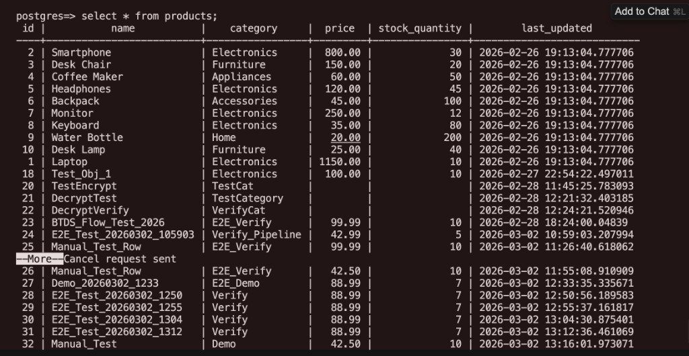
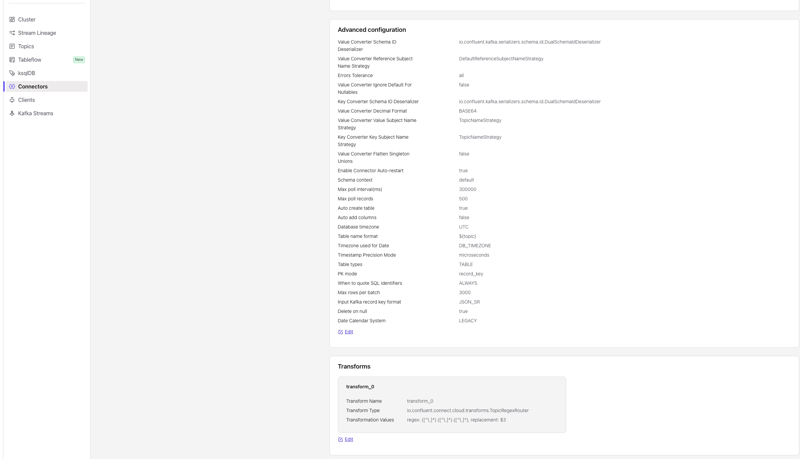
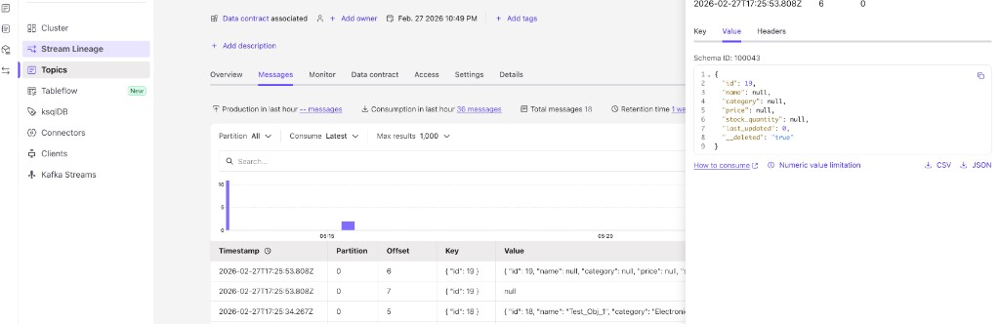
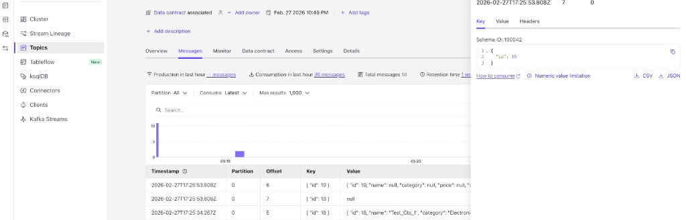
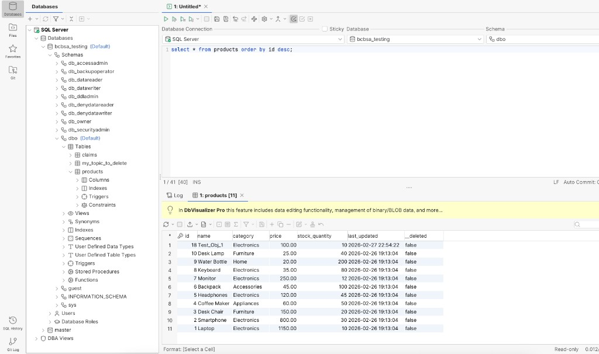

# CDC Pipeline: PostgreSQL → Debezium → MSK → Replicator → Confluent Cloud → SQL Server Connector → SQL Database

**Purpose**: End-to-end CDC from PostgreSQL RDS to SQL Server/Azure SQL. Data flows through Debezium, AWS MSK, Replicator on Azure VM, Confluent Cloud, and the SQL Server Sink Connector. Includes optional field-level encryption.

**Last Updated**: March 2026

**Screenshots:** Place images in `docs/images/`. See `docs/images/README.md` for the mapping.

---

## Table of Contents

1. [Architecture Overview](#1-architecture-overview)
2. [Data Flow](#2-data-flow)
3. [Component Map](#3-component-map)
4. [① PostgreSQL (Source)](#4-postgresql-source)
5. [② Debezium (EC2)](#5-debezium-ec2)
6. [③ AWS MSK](#6-aws-msk)
7. [④ Replicator (Azure VM)](#7-replicator-azure-vm)
8. [⑤ Confluent Cloud](#8-confluent-cloud)
9. [⑥ SQL Server Sink Connector](#9-sql-server-sink-connector)
10. [⑦ SQL Database (Target)](#10-sql-database-target)
11. [Message Format & Envelope](#11-message-format--envelope)
12. [Security: IAM & Encryption](#12-security-iam--encryption)
13. [Quick Reference Commands](#13-quick-reference-commands)
14. [Downstream: Confluent Cloud → SQL Database](#downstream-confluent-cloud--sql-database)

---

## 1. Architecture Overview

### 1.1 High-Level Flow

```
┌─────────────────┐     ┌─────────────────────────┐     ┌─────────────┐     ┌─────────────────────┐     ┌──────────────────┐     ┌─────────────────────┐     ┌──────────────────┐
│ PostgreSQL RDS  │     │      EC2 (AWS)         │     │   AWS MSK   │     │  Azure VM / Docker   │     │ Confluent Cloud   │     │ FMC SQL Server      │     │  Azure SQL        │
│    (Source)     │     │ kafka-connect-worker   │     │  (Kafka)    │     │     Replicator       │     │                   │     │    Connector         │     │   Database        │
├─────────────────┤     ├─────────────────────────┤     ├─────────────┤     ├─────────────────────┤     ├──────────────────┤     ├─────────────────────┤     ├──────────────────┤
│ • public.       │ WAL │ • Kafka Connect        │ CDC │ Topic:      │ IAM │ • Consumes from MSK │ API │ • products        │ FMC │ • Consumes from CC   │ JDBC │ • products        │
│   products      │────▶│ • Debezium Connector   │────▶│ psgsrc_     │────▶│ • Produces to CC    │────▶│                   │────▶│ • Writes to SQL      │────▶│   table            │
│ • WAL=logical   │5432 │ • Optional: SMT Encrypt│9098 │   encrypt_  │9198 │ • Optional: SMT     │ key │                   │     │                     │     │                   │
│ • SSL/TLS       │     │   (Kryptonite/BTDS)    │     │   v1.*      │     │   Decrypt           │     │                   │     │                     │     │                   │
└─────────────────┘     └─────────────────────────┘     └─────────────┘     └─────────────────────┘     └──────────────────┘     └─────────────────────┘     └──────────────────┘
        │                              │                        │
        │ 5432 (SSL)                   │ 9098 (SASL_SSL + IAM)  │
        │ pgoutput                     │                        │
        └──────────────────────────────┴────────────────────────┘
                         VPC (AWS Region)
```

### 1.2 End-to-End Flow

```
PostgreSQL → Debezium → MSK → Replicator → Confluent Cloud → SQL Server Connector → SQL Database
```

---

## 2. Data Flow

| Stage | Component | From | To | Protocol |
|-------|-----------|------|-----|----------|
| **①** | PostgreSQL | — | Debezium | WAL (pgoutput), port 5432, SSL |
| **②** | Debezium | PostgreSQL | MSK | SASL_SSL + IAM, port 9098 |
| **③** | MSK | Debezium | — | Kafka topics (CDC events) |
| **④** | Replicator | MSK | Confluent Cloud | SASL_SSL + IAM (consume), SASL_SSL + API key (produce) |
| **⑤** | Confluent Cloud | Replicator | — | Kafka topics (JSON Schema) |
| **⑥** | SQL Server Sink | Confluent Cloud | SQL Database | SASL_SSL (consume), JDBC/TLS (write) |
| **⑦** | SQL Database | SQL Server Sink | — | Final destination |

---

## 3. Component Map

| # | Component | Location | Role |
|---|-----------|----------|------|
| ① | **PostgreSQL** | AWS RDS, private subnet | Source DB; `public.products` |
| ② | **Debezium** | EC2 (Kafka Connect) | CDC from PostgreSQL → MSK |
| ③ | **AWS MSK** | AWS, private subnet | Kafka cluster; topics |
| ④ | **Replicator** | Azure VM / Docker | MSK → Confluent Cloud |
| ⑤ | **Confluent Cloud** | Cloud | Destination Kafka |
| ⑥ | **SQL Server Sink** | Confluent Cloud (FMC) | Consume CDC → write to SQL |
| ⑦ | **SQL Database** | Azure SQL | Target; `products` table |

### 3.1 How to Reproduce This Setup

Follow the flow in order. Each section contains the configuration for that component:

| Step | Section | Action |
|------|---------|--------|
| 1 | [4. PostgreSQL](#4-postgresql-source) | Ensure RDS has `wal_level=logical`, create `products` table |
| 2 | [5. Debezium](#5-debezium-ec2) | Deploy Kafka Connect on EC2, configure `connect-distributed.properties`, create Debezium connector |
| 3 | [6. AWS MSK](#6-aws-msk) | Create MSK cluster, configure IAM, use `msk-client.properties` for CLI tools |
| 4 | [7. Replicator](#7-replicator-azure-vm) | Deploy Docker on Azure VM, create Replicator connector |
| 5 | [8. Confluent Cloud](#8-confluent-cloud) | Create cluster and Schema Registry, obtain API keys |
| 6 | [9. SQL Server Sink](#9-sql-server-sink-connector) | Create FMC connector in Confluent Cloud |
| 7 | [10. SQL Database](#10-sql-database-target) | Create target database and verify data |

---

## 4. ① PostgreSQL (Source)

### 4.1 Prerequisites (RDS)

For logical replication (required for Debezium):

| Parameter | Value |
|-----------|-------|
| `rds.logical_replication` | `1` |
| `wal_level` | `logical` |

Set via RDS Parameter Group. Reboot may be required.

### 4.2 `public.products` Table

The source table in PostgreSQL RDS. Debezium captures changes via logical replication (pgoutput).

#### Table Schema

| Column | Type | Notes |
|--------|------|-------|
| `id` | INTEGER | Primary key |
| `name` | VARCHAR | Product name |
| `category` | VARCHAR | Category |
| `price` | DECIMAL(10,2) | Price (nullable) |
| `stock_quantity` | INTEGER | Stock (nullable) |
| `last_updated` | TIMESTAMP | Last update time |

#### Verification Queries

```sql
-- All rows
SELECT * FROM products;

-- Row count
SELECT COUNT(*) FROM products;

-- Latest updated
SELECT * FROM products ORDER BY last_updated DESC;

-- Schema (psql)
\d public.products
```

#### Sample Data (Representative)

| id | name | category | price | stock_quantity | last_updated |
|----|------|----------|-------|----------------|--------------|
| 1 | Laptop | Electronics | 1150.00 | 10 | 2026-02-26 19:13:04 |
| 2 | Smartphone | Electronics | 800.00 | 30 | 2026-02-26 19:13:04 |
| 3 | Desk Chair | Furniture | 150.00 | 20 | 2026-02-26 19:13:04 |
| 33 | Wireless Headphones | Electronics | 79.99 | 50 | 2026-03-04 15:40:28 |

**Note:** `price` and `stock_quantity` may be NULL for some rows. The CDC pipeline propagates all columns to Kafka and SQL Server.



---

## 5. ② Debezium (EC2)

Debezium runs on EC2 as a Kafka Connect worker. It captures CDC from PostgreSQL via logical replication (pgoutput) and produces to MSK.

### 5.1 Role

| Aspect | Details |
|--------|---------|
| **Location** | EC2 in AWS (public subnet) |
| **Input** | PostgreSQL WAL (port 5432, SSL) |
| **Output** | MSK topics (port 9098, SASL_SSL + IAM) |
| **Optional** | SMT encryption for field-level encryption |

### 5.2 Kafka Connect – `connect-distributed.properties`

Copy `config/connect-distributed.properties.example` to `connect-distributed.properties` and replace placeholders.

| Placeholder | Purpose |
|-------------|---------|
| `<MSK_BOOTSTRAP_SERVERS>` | MSK broker list (e.g. `b-1.xxx.kafka.region.amazonaws.com:9098,...`) |
| `<CONNECT_GROUP_ID>` | Connect cluster group (e.g. `connect-cluster`) |
| `<CONNECT_CONFIG_TOPIC>` | Config storage topic (e.g. `connect-config-v2`) |
| `<CONNECT_OFFSET_TOPIC>` | Offset storage topic (e.g. `connect-offsets-v2`) |
| `<CONNECT_STATUS_TOPIC>` | Status storage topic (e.g. `connect-status-v2`) |
| `<PLUGIN_PATH>` | Path to plugins (e.g. `/home/ec2-user/kafka-connect/plugins`) |

```properties
# Kafka Connect distributed mode
bootstrap.servers=<MSK_BOOTSTRAP_SERVERS>

group.id=<CONNECT_GROUP_ID>
config.storage.topic=<CONNECT_CONFIG_TOPIC>
offset.storage.topic=<CONNECT_OFFSET_TOPIC>
status.storage.topic=<CONNECT_STATUS_TOPIC>
config.storage.replication.factor=2
offset.storage.replication.factor=2
status.storage.replication.factor=2

rest.port=8083
rest.advertised.host.name=0.0.0.0

# IAM auth to MSK
security.protocol=SASL_SSL
sasl.mechanism=AWS_MSK_IAM
sasl.jaas.config=software.amazon.msk.auth.iam.IAMLoginModule required;
sasl.client.callback.handler.class=software.amazon.msk.auth.iam.IAMClientCallbackHandler

key.converter=org.apache.kafka.connect.json.JsonConverter
key.converter.schemas.enable=true
value.converter=org.apache.kafka.connect.json.JsonConverter
value.converter.schemas.enable=true

connect.config.providers=file
connect.config.providers.file.class=org.apache.kafka.common.config.provider.FileConfigProvider

plugin.path=<PLUGIN_PATH>
```

### 5.3 Debezium Connector (with SMT Encryption)

Create the connector via REST (`POST /connectors`):

```json
{
  "name": "debezium-postgres-psgsrc-encrypt-v1",
  "config": {
    "connector.class": "io.debezium.connector.postgresql.PostgresConnector",
    "database.hostname": "<RDS_HOST>",
    "database.port": "5432",
    "database.user": "<DB_USER>",
    "database.password": "<DB_PASSWORD>",
    "database.dbname": "<DB_NAME>",
    "database.server.name": "psgsrc",
    "topic.prefix": "psgsrc_encrypt_v1",
    "table.include.list": "public.products",
    "plugin.name": "pgoutput",
    "database.sslmode": "verify-full",
    "database.sslrootcert": "/certs/global-bundle.pem",
    "producer.override.security.protocol": "SASL_SSL",
    "producer.override.sasl.mechanism": "AWS_MSK_IAM",
    "producer.override.sasl.jaas.config": "software.amazon.msk.auth.iam.IAMLoginModule required;",
    "producer.override.sasl.client.callback.handler.class": "software.amazon.msk.auth.iam.IAMClientCallbackHandler",
    "key.converter": "org.apache.kafka.connect.json.JsonConverter",
    "key.converter.schemas.enable": "true",
    "value.converter": "org.apache.kafka.connect.json.JsonConverter",
    "value.converter.schemas.enable": "true",
    "publication.name": "dbz_publication_products_v1",
    "slot.name": "debezium_psgsrc_products_v1",
    "snapshot.mode": "initial",
    "topic.creation.default.replication.factor": "2",
    "topic.creation.default.partitions": "6",
    "time.precision.mode": "connect",
    "transforms": "encrypt",
    "transforms.encrypt.type": "com.btds.Encryption",
    "transforms.encrypt.key": "<BASE64_ENCRYPTION_KEY>"
  }
}
```

**Placeholders:** `<RDS_HOST>`, `<DB_USER>`, `<DB_PASSWORD>`, `<DB_NAME>`, `<BASE64_ENCRYPTION_KEY>`

### 5.4 Verification

```bash
# List connectors
curl -s http://localhost:8083/connectors

# Connector status
curl -s http://localhost:8083/connectors/debezium-postgres-psgsrc-encrypt-v1/status
```

---

## 6. ③ AWS MSK

MSK hosts the Kafka topics produced by Debezium. The Replicator consumes from MSK using IAM auth.

### 6.1 Role

| Aspect | Details |
|--------|---------|
| **Location** | AWS, private subnet |
| **Ports** | 9098 (private VPC), 9198 (public) |
| **Auth** | SASL_SSL + IAM |

### 6.2 MSK Client – `msk-client.properties`

For `kafka-console-consumer.sh`, `kafka-console-producer.sh`, etc. Copy `config/msk-client.properties.example` to `msk-client.properties`.

```properties
security.protocol=SASL_SSL
sasl.mechanism=AWS_MSK_IAM
sasl.jaas.config=software.amazon.msk.auth.iam.IAMLoginModule required;
sasl.client.callback.handler.class=software.amazon.msk.auth.iam.IAMClientCallbackHandler
```

### 6.3 IAM Permissions

The IAM principal (EC2 instance profile or IAM user for Azure VM) must have:

```json
{
  "Effect": "Allow",
  "Action": [
    "kafka-cluster:Connect",
    "kafka-cluster:DescribeCluster",
    "kafka-cluster:DescribeTopic",
    "kafka-cluster:ReadData",
    "kafka-cluster:WriteData",
    "kafka-cluster:CreateTopic",
    "kafka-cluster:DescribeGroup",
    "kafka-cluster:AlterGroup"
  ],
  "Resource": [
    "arn:aws:kafka:<region>:<account>:cluster/<cluster-name>/*",
    "arn:aws:kafka:<region>:<account>:topic/<cluster-name>/*",
    "arn:aws:kafka:<region>:<account>:group/<cluster-name>/*"
  ]
}
```

### 6.4 Consume from MSK (Verification)

```bash
./bin/kafka-console-consumer.sh \
  --bootstrap-server <MSK_PUBLIC_BOOTSTRAP_SERVERS> \
  --consumer.config ~/msk-client.properties \
  --topic psgsrc_encrypt_v1.public.products \
  --from-beginning \
  --max-messages 5
```

**Note:** Encrypted payloads appear as base64. Decryption happens in the Replicator.

---

## 7. ④ Replicator (Azure VM)

The Replicator runs in Docker on an Azure VM. It consumes from MSK and produces to Confluent Cloud, with optional SMT decryption and `ExtractNewRecordState`.

### 7.1 Role

| Aspect | Details |
|--------|---------|
| **Location** | Azure VM / Docker |
| **Input** | MSK (SASL_SSL + IAM, port 9198) |
| **Output** | Confluent Cloud (SASL_SSL + API key) |
| **Transforms** | Decrypt (optional), ExtractNewRecordState |

### 7.2 Docker Setup

| File | Purpose |
|------|---------|
| `docker/Dockerfile` | Kafka Connect image with plugin paths |
| `docker/docker-compose.yml` | Replicator service |
| `docker/.env.example` | Placeholder env vars (copy to `.env`) |

**Dockerfile:**

```dockerfile
FROM confluentinc/cp-kafka-connect:7.6.0
ENV CONNECT_PLUGIN_PATH="/usr/share/java,/usr/share/confluent-hub-components,/plugins"
RUN mkdir -p /plugins/aws-msk-iam-auth /plugins/btds-encryption
```

**Run:**

```bash
# 1. Add plugin JARs to plugins/aws-msk-iam-auth/ and plugins/btds-encryption/
# 2. Create .env from docker/.env.example
# 3. Ensure ~/.aws/credentials has MSK IAM access

cd /path/to/bluesquared
docker-compose -f docker/docker-compose.yml up -d
```

### 7.3 Replicator Connector

Copy `config/replicator-connector.json.example` to `replicator-connector.json`, replace placeholders, then:

```bash
curl -s -X POST -H "Content-Type: application/json" \
  -d @config/replicator-connector.json \
  http://localhost:8083/connectors
```

**Connector config (with SMT Decryption):**

```json
{
  "name": "msk-to-confluent-cloud-replicator-encrypted",
  "config": {
    "connector.class": "io.confluent.connect.replicator.ReplicatorSourceConnector",
    "tasks.max": "1",
    "topic.whitelist": "psgsrc_encrypt_v1.public.products",
    "topic.rename.format": "${topic}",
    "src.kafka.bootstrap.servers": "<MSK_BOOTSTRAP_SERVERS>",
    "src.kafka.security.protocol": "SASL_SSL",
    "src.kafka.sasl.mechanism": "AWS_MSK_IAM",
    "src.kafka.sasl.jaas.config": "software.amazon.msk.auth.iam.IAMLoginModule required;",
    "src.kafka.sasl.client.callback.handler.class": "software.amazon.msk.auth.iam.IAMClientCallbackHandler",
    "src.kafka.ssl.endpoint.identification.algorithm": "https",
    "src.consumer.group.id": "replicator-source-consumer-v1",
    "src.consumer.auto.offset.reset": "earliest",

    "src.key.converter": "org.apache.kafka.connect.json.JsonConverter",
    "src.key.converter.schemas.enable": "true",
    "src.value.converter": "org.apache.kafka.connect.json.JsonConverter",
    "src.value.converter.schemas.enable": "true",

    "dest.kafka.bootstrap.servers": "<CCLOUD_BOOTSTRAP_SERVERS>",
    "dest.kafka.security.protocol": "SASL_SSL",
    "dest.kafka.sasl.mechanism": "PLAIN",
    "dest.kafka.sasl.jaas.config": "org.apache.kafka.common.security.plain.PlainLoginModule required username='<CCLOUD_API_KEY>' password='<CCLOUD_API_SECRET>';",
    "dest.kafka.ssl.endpoint.identification.algorithm": "https",
    "confluent.topic.replication.factor": "3",
    "dest.topic.replication.factor": "3",
    "topic.auto.create": "true",
    "topic.preserve.partitions": "true",
    "topic.config.sync": "false",
    "offset.timestamps.commit": "false",
    "offset.topic.commit": "true",
    "provenance.header.enable": "true",

    "header.converter": "org.apache.kafka.connect.converters.ByteArrayConverter",

    "key.converter": "io.confluent.connect.json.JsonSchemaConverter",
    "key.converter.schema.registry.url": "<SCHEMA_REGISTRY_URL>",
    "key.converter.basic.auth.credentials.source": "USER_INFO",
    "key.converter.basic.auth.user.info": "<SR_API_KEY>:<SR_API_SECRET>",

    "value.converter": "io.confluent.connect.json.JsonSchemaConverter",
    "value.converter.schema.registry.url": "<SCHEMA_REGISTRY_URL>",
    "value.converter.basic.auth.credentials.source": "USER_INFO",
    "value.converter.basic.auth.user.info": "<SR_API_KEY>:<SR_API_SECRET>",

    "transforms": "decrypt,extractNewRecordState",
    "transforms.decrypt.type": "com.btds.Decryption",
    "transforms.decrypt.key": "<BASE64_ENCRYPTION_KEY>",

    "transforms.extractNewRecordState.type": "io.debezium.transforms.ExtractNewRecordState",
    "transforms.extractNewRecordState.flatten.struct.field": "payload",
    "transforms.extractNewRecordState.delete.tombstone.handling.mode": "rewrite-with-tombstone",

    "errors.tolerance": "none",
    "errors.log.enable": "true",
    "errors.log.include.messages": "true"
  }
}
```

**Placeholders:** `<MSK_BOOTSTRAP_SERVERS>`, `<CCLOUD_BOOTSTRAP_SERVERS>`, `<CCLOUD_API_KEY>`, `<CCLOUD_API_SECRET>`, `<SCHEMA_REGISTRY_URL>`, `<SR_API_KEY>`, `<SR_API_SECRET>`, `<BASE64_ENCRYPTION_KEY>`

### 7.4 Azure VM – AWS Credentials

The Replicator consumes from MSK but runs on Azure. Use one of:

| Method | Use Case |
|--------|----------|
| `~/.aws/credentials` | Mounted into Docker; IAM user access keys |
| Environment variables | `AWS_ACCESS_KEY_ID`, `AWS_SECRET_ACCESS_KEY`, `AWS_REGION` |

---

## 8. ⑤ Confluent Cloud

Confluent Cloud receives replicated topics from the Replicator. Topics use JSON Schema (JSON_SR) via Schema Registry.

### 8.1 Role

| Aspect | Details |
|--------|---------|
| **Input** | Replicator produces flattened CDC (ExtractNewRecordState) |
| **Format** | JSON Schema; Schema Registry required |
| **Auth** | API key + secret for Kafka and Schema Registry |

### 8.2 Setup

1. Create a Confluent Cloud cluster (Basic or Standard).
2. Create API keys for the cluster (Cluster Settings → API Keys).
3. Create Schema Registry and API keys (Schema Registry → API Keys).
4. Use these in the Replicator connector: `CCLOUD_BOOTSTRAP_SERVERS`, `CCLOUD_API_KEY`, `CCLOUD_API_SECRET`, `SCHEMA_REGISTRY_URL`, `SR_API_KEY`, `SR_API_SECRET`.

### 8.3 Verification

In Confluent Cloud UI: Topics → `psgsrc_encrypt_v1.public.products` (or topic name from Replicator). Messages should show flattened JSON with `id`, `name`, `category`, etc.

---

## 9. ⑥ SQL Server Sink Connector

Confluent Cloud Fully Managed Connector (FMC) consumes CDC from Confluent Cloud and writes to SQL Server / Azure SQL.

### 9.1 Role

| Aspect | Details |
|--------|---------|
| **Location** | Confluent Cloud (FMC) |
| **Input** | Confluent Cloud topics (JSON_SR) |
| **Output** | SQL Server / Azure SQL via JDBC |

### 9.2 Basic Configuration

| Setting | Value | Notes |
|---------|-------|-------|
| **Connector** | Microsoft SQL Server Sink | Confluent Cloud FMC |
| **Topics** | `psgsrc_encrypt_v1.public.products` | Match Replicator output |
| **Connection host** | `<SQL_SERVER_HOST>` | Azure: `<server>.database.windows.net` |
| **Connection port** | `1433` | Default SQL Server port |
| **Connection user** | `<SQL_USER>` | `db_datareader`, `db_datawriter` |
| **Connection password** | `<SQL_PASSWORD>` | Use secrets manager in production |
| **Database name** | `<DATABASE_NAME>` | Target database |
| **SSL mode** | `require` | Required for Azure SQL |
| **Input Kafka record value format** | `JSON_SR` | Schema Registry required |
| **Input Kafka record key format** | `JSON_SR` | Schema Registry required |
| **Insert mode** | `UPSERT` | Idempotent inserts/updates |
| **PK mode** | `record_key` | Use record key for primary key |
| **Auto create table** | `true` | Creates tables if missing |



### 9.3 Advanced Configuration

| Category | Setting | Value |
|----------|---------|-------|
| **Converter** | Value Converter Schema ID Deserializer | `io.confluent.kafka.serializers.schema.id.DualSchemaIdDeserializer` |
| | Value Converter Reference Subject Name Strategy | `DefaultReferenceSubjectNameStrategy` |
| | Key Converter Schema ID Deserializer | `io.confluent.kafka.serializers.schema.id.DualSchemaIdDeserializer` |
| | Value Converter Decimal Format | `BASE64` |
| | Value Converter Value Subject Name Strategy | `TopicNameStrategy` |
| | Key Converter Key Subject Name Strategy | `TopicNameStrategy` |
| | Value Converter Flatten Singleton Unions | `false` |
| **Error Handling** | Errors Tolerance | `all` |
| | Value Converter Ignore Default For Nullables | `false` |
| | Enable Connector Auto-restart | `true` |
| | Delete on null | `true` |
| **Polling** | Schema context | `default` |
| | Max poll interval (ms) | `300000` |
| | Max poll records | `500` |
| **Database** | Auto create table | `true` |
| | Auto add columns | `false` |
| | Database timezone | `UTC` |
| | Table name format | `${topic}` |
| | Timezone used for Date | `DB_TIMEZONE` |
| | Timestamp Precision Mode | `microseconds` |
| | Table types | `TABLE` |
| | PK mode | `record_key` |
| | When to quote SQL identifiers | `ALWAYS` |
| | Max rows per batch | `3000` |
| | Date Calendar System | `LEGACY` |

### 9.4 Transforms – TopicRegexRouter

Map Debezium topic names to simple table names:

| Setting | Value |
|---------|-------|
| **Transform Name** | `transform_0` |
| **Transform Type** | `io.confluent.connect.cloud.transforms.TopicRegexRouter` |
| **regex** | `([^\.]*).([^\.]*).([^\.]*)` |
| **replacement** | `$3` |

| Source Topic | Result |
|--------------|--------|
| `psgsrc_encrypt_v1.public.products` | `products` |
| `psgsrc.public.products` | `products` |

---

## 10. ⑦ SQL Database (Target)

The SQL Server Sink writes to the target `products` table in SQL Server / Azure SQL. See [Downstream: Confluent Cloud → SQL Database](#downstream-confluent-cloud--sql-database) at the end of this document for the full downstream message format, target schema, verification, and outcome.

---

## 11. Message Format & Envelope

### 11.1 `public.products` Topic

#### Encrypted Topic (MSK)

When consuming from the encrypted topic in MSK (e.g. `psgsrc_encrypt_v1.public.products`), the payload appears as base64-encoded ciphertext. The Debezium SMT encrypts the value before producing to Kafka.

**Raw message structure:**

```json
{"schema":null,"payload":"hVBjW/PwGsJ+lFIsWwQsE8FKXDyE+K310X41XWo607gykJlsCRwNlT7PaM6Vb7k/DZVU/HPxclI+Gf/bS9j75l0CTAMwueOHHioaSlNBIcFRiWKwQTwHJc+r/z3ppqGo46zrY0dJhM8Vg3mY/Nr6gn+WRz8wav0SrkXgCx/72nH7vPiDLTNeiIzkLobZSzznAkn6fDDVGYFjbUWV7MGiQTJTNj0XjeOBdhIMVBTM2pPByR9jkv9/IzIMJvAUGTnMTgs/sPMRSNuqIRv68Wo0svYL8vwI4kG+Pdyaj+R2j5mU2asQKU7JNlDB8DRxceDN/n22JU1eg6ARr6gSIO6v05qW5VzXMO46S59sPb0f040wn2o6VQmBpOLLESXR+Y1PWdLx7FXh97t5tgVAQ+TFVq/379wUBh2ZlXJC+k8dKvLjGt+EEyjjKhZhyt1a8GQY+m5vavjMPjTId13A+W//FE1YD97C28zos1OsRjMqDq78Vacj6TZpKXrxJLlma8uEUO7Cf0enGhxw7HLRVHS2yt4NOUaSA6K4TG2eemOO+I5AdK61wSxPkmwbTxT9HFDiWZy6goJrGaCWZniOkD0+oEk7HF0g320mdYqbnY6dpamIKTgwjUn2xZAF9hqiwd1+pfEE3bxzwYBD8FxQZMs6dDZUFv7nnSbt9TVj45k7aAdoRVDzGGwkn7VsSOxxGJm0tvnI8putTbPvv4m495kV8H2rfNBX88UQ6Bo8zH9j2GDRHHSKYhzaXQWV61skEDqbcdTkbutdn+gFsuHGGkx67atCWaS7W74X5zMj07SRx3E71DnZE2cp9Jt8Aw+lladcajlUYeA0A432CwdoU/T0MLSgcfLxkEzclrI4ueCK8wrMAORu+jUXLnw6/ORoBLgLVHDWPo4xTXUxaXUkQoVN0NnUY4Ewp1uwPXlD50dch+CuRBXsYlOh1s4q3v55+iMYufRdqkRAh7E9ga9xB0Ffyas0VazXOo2GbVC81Zd7bEc4TS1yTxsXwxiT3ohAR7eNTuA264GImYXlrRD4/7EiOwqV1s/WxOc5h7MH+orqkac8yTLXjWjflzx8rMywfl02/pCj5848gTUmmNRjNH5BYi15WB1TGUmNFTDuyWee+4KZeADm2xsvpqTI9LGKOInNS1mgZVg9izcAMIv/xLi+Pjo/53/rL1kCbJWK/W/55Ml27yUBYkMwnZKqUcVyBc3sx3qlE41t12wAhsHB/seNtMeSrECKLSX4p2gAvwv0weerg2Ajd7XVfDOFvoY0aiRHHm5XQBZytOvCVi0oU1v24J6Q+pAQSfb9N+nw25M9sBz5tqMcAdl4+es8TjXGGJDqk2aNnmsfRH32P2E4XUQfIpDKqYpDL9Ru3uVWryII3XfBqHeyOE4pcnHViu1Uzr6lDQC4f/VI37oK8gyY7BHC6l32ZBcAz8AzYCgA++WhskqdiEcBOnzfwCUze08psNzubsQIEts2DYgkSUtf9FTIcoartcaT6PrBmP8TlbOkbhEVp8hrGg4crDED30tozs7WlwbFaHz7nVj0+JdBwSmuZrjriFZBUt+gzOmTZ67uxgrnd65X+wd/2wTVxYhDPPc4yVhX9kBx2IKsNHqCx3faj8x5X6XltnsyCfzQG30WrHv3AvYsALoLXMIwiWxY0nc2cTCe0RYE6LtcuEqrpQxlQPTApIjh/Pn6BzZVKQ0vL3PbspMsmD0rT6T2kX9wPpSjbnZwJnWKe/08PAMfQdf8Pqn1B7dbkW90Y9vul/9jaPIJZC20wEzpmloMq614CxruBQ9gKOT/dzEUFPNq5gehheHcmpmE7HyeQNiSWzd28jok+uQklKSWLQpc2wqB8a0j8l/zOCtNjIebCZ45KDE921iywVrbWDkSxQI2tgpHat70llQDJl5hFinl0r7XzbyLlSQ2tW8fvK+wi4NXsmhLIxbEqtqnEaEvQmCuHRCPxPHa6wvJkylydwSOnS5Y5+7SUzSksdssGtho9pwsVRfdFV/ltvYtyQetZS+/2IfxPP0AwC21fziAtPjSeiyrJ7UVvbzptZ6zECIImue0yFibEszrp8VsG/L0wc8XC46qFqEu8LgPxUuvCEywZZJiFHGH/cu05UUdMVOrxJNWXhI5iCJsByh2DpfN3oCy0Zqum4WatE+Zky2cRiazwl5WjcraLVSU9kvqhdX4My8BJSBp3jWLkjgBXjSTrei/dCyRJLfmJtOmGCEiAbDApTE2PXEUn/BZBm/5GsycjfG48kFX7JroCllVE+COn9fLfO41lsHL0XNTYMw2zQ2f78EwVwWcg7sNp9TUcPK0hhRnDCMo7jKPcxKWrfs5yS7f+vYH5whHHHJmXXyHHIkRJp4bUwTpPFO4JQERdxxQ6fRHFEMLQlNQtV08J/zOu7chh7ZhOc092JLTjNU2FFIZojSNdPfu+m/pJ24CfRTmeM4LV4a/0eZg7GQERmwdtOqpLS7h378X6+gmnEck2gJ7gLSbchOOsV0+tdiRKbTADUtgGhoUf6zsmd/BrmHRpTGwcG6qisQ1lgcJSxMNbHxspf4YIRP0eawNIobL/vI2HoY9bklA3XrPVzJJ1g+OqwAB9fiEv2sJAlxwp+1N3P6OA5UG78KAvJB+VcUk8/zJwqq2NV9DKrsO72tQ3bOlqexD+/Kf+B9tWAeFG7PJ4AxMiWGPizaW2W/Ti3TNVnpgPKp5iRWDCoPgiEq7DiPYooHoKKRACVdvbTpM3d4sTuSDJd5z1gtA/gqEzPECpE1WPUlADtAULnPBMq8SI74osJtomjtL1zWKmFV50Z3W1kMVJnhIeiMh3h2f4vfdcMereaUrFwCWJaeZ7P13oULpJvm/bjpYRLK3Ggr8KTyb81AruemOFJE1NkIgiQVONLky4cIdlZe7dXKZh7MBaEuAQTAD0aGl4rLffD3lo3OFkQkumY3BZQczHAdbyszasnuD6ai2hGwFgPdh9DS/zOS5Kopl2UfXfGlZq4rNGQqznLTOOe2qjIdaU5/vCmbEQzlanGMtS4jHdh/EpqwOCPo6opylaqhJ1vaL0P7OEefb0hTyxHeNrbDHsz40UNqrGh/gkHFLFMOZGRMB8wpzDHhiXGtnKvCVCWfx9fLKYdkWNfhzma+hqh7W2v8a+QMKx0Q4F+JiquJ5fQt6NgqNbA9O0428JJsLr+A00Oe8CEn800IgyYhlql0Z103M2tn+c1AG3outvuJbFEGIxzY5yoUkjzNhOLx3NYHFL91yHBypNVLucDUrGvbu73hyfTMgVTxxNx8wVpNT8JSuiT1J5YT5LfNvYwKQxhzbZ267PIEJ5AY2jCLvs4jH/NIVhj8rdzhK7W+62MukB4eWippOk3WUSmoP52VEA99+bYT+1nvKh1vU+kiK09I5EGQM12xT5n9h2fufMkxLrPtWvFjWiVmlY3YTaIdXQZQXU+pqUkoM0i9m1e7Xw27mTxG6EFmvB7Hnfe6FPdbjUfWjENcslkkTycpwCaRrwAWAozaXry+xHu6vhahqAIHfXUunHOr6MVaaMuxi8mN9fRd4NHL6m91GnguCz9f/RC093lhU0atymNbhTtZkhsifnVklyipAnZvq8ylARFY0LQYaD50D4gl7bGI8bxp09I9vZ130JvJz4PYenrr528AxXF3/BaDB/CYSov4knaxdIE6c378ib+97du7zp4/g3GngdJuDHq3kYcnCtFBh7hja8EnT6JtT0PhbVq93w5yn+EVl2CHr4R3IA7H0WeUyWJ6tK05qXRMw1lQwhBMMycXHv1eVrqXUZ5jNF7ZJldLbmOxAx67gMDPuNtqb9N+BHky+CjtgTaPuof9RfrgD6RLKNjY6CQXviHU3FAu4Ln7nGBeh+Ugi7jGj2GzBPWgB94VIX44KFL1gaogF2ZkUwF+RWhzMu/avyvW+26JCin8gSrCT1El4ylcR0JrQBE0M5y8b0S+vWCexR9clG2iqtDBZFGbV9yJmtqm3LKsl/uoNT0PqxsI1Q0TaVZnIJICJi+5SmDnCOC+FLGrYLOUWGRvQrJUWrVsGvyIse1oCsOO5rzL6aXndeiSYO1nsFXm0GE2jVX8EPBpsfLgvSeX9oul4qPPzGnJ6jtXj1LO1pBhsQ=="}
```

The `payload` field contains base64-encoded ciphertext. **Decryption happens in the Replicator SMT** before producing to Confluent Cloud. The SQL Server Sink and downstream consumers never see the encrypted form.

**Consume from encrypted topic (MSK):**

```bash
./bin/kafka-console-consumer.sh \
  --bootstrap-server <MSK_PUBLIC_BOOTSTRAP_SERVERS> \
  --consumer.config ~/msk-client.properties \
  --topic psgsrc_encrypt_v1.public.products \
  --from-beginning \
  --max-messages 5
```

---

### 11.2 Debezium Envelope (Source)

Before transforms, Debezium produces a wrapped envelope:

```json
{
  "schema": { ... },
  "payload": {
    "before": null,
    "after": { "id": 19, "name": "Wireless Headphones", ... },
    "source": {
      "version": "2.5.0",
      "connector": "postgresql",
      "name": "psgsrc",
      "ts_ms": 1730138753808,
      "db": "postgres",
      "table": "products"
    },
    "op": "c",
    "ts_ms": 1730138753808
  }
}
```

| Field | Purpose |
|-------|---------|
| `before` | Previous row state (null for INSERT) |
| `after` | New row state |
| `source` | Connector metadata (db, table, ts_ms) |
| `op` | Operation: `c`=create, `u`=update, `d`=delete |
| `ts_ms` | Event timestamp |

### 11.3 Confluent Cloud Envelope (Confluent Wire Format)

Confluent Cloud uses Schema Registry for serialization. Messages include:

| Component | Description |
|-----------|-------------|
| **Magic byte** | Schema format identifier |
| **Schema ID** | 4-byte schema ID from Schema Registry |
| **Payload** | Serialized JSON (or Avro, Protobuf) |

The schema ID is stored in the message envelope; consumers use it to fetch the schema from Schema Registry for deserialization.

### 11.4 After ExtractNewRecordState

The Replicator uses `ExtractNewRecordState` to flatten the Debezium envelope:

| Input | Output |
|-------|--------|
| `payload.after` | Becomes the message value |
| `payload.before` | Used for delete detection |
| `source`, `op` | Removed or in headers |

**Insert/Update value:**

```json
{
  "id": 19,
  "name": "Wireless Headphones",
  "category": "Electronics",
  "price": 79.99,
  "stock_quantity": 50,
  "last_updated": 1730138753808
}
```

**Delete:** Tombstone (value = `null`) with same key; optional `__deleted` payload before tombstone.

### 11.5 Headers (Provenance)

With `provenance.header.enable=true`, the Replicator adds headers:

| Header | Purpose |
|--------|---------|
| `confluent.replicator.source.topic` | Source topic name |
| `confluent.replicator.source.partition` | Source partition |
| `confluent.replicator.source.offset` | Source offset |

---

## 12. Security: IAM & Encryption

### 12.1 IAM Authentication (AWS MSK)

AWS MSK uses IAM-based authentication. The pipeline uses IAM for both the Kafka Connect worker (EC2) and the Replicator (Azure VM).

| Aspect | Details |
|--------|---------|
| **Mechanism** | SASL `AWS_MSK_IAM` with `IAMLoginModule` |
| **Credentials** | Short-lived SigV4 signatures from IAM credentials |
| **Ports** | 9098 (private VPC), 9198 (public) – both SASL_SSL |

The `aws-msk-iam-auth` JAR provides `IAMLoginModule` and `IAMClientCallbackHandler`. Credentials are resolved in this order:

1. **Environment:** `AWS_ACCESS_KEY_ID`, `AWS_SECRET_ACCESS_KEY`, `AWS_SESSION_TOKEN`
2. **Shared credentials:** `~/.aws/credentials`
3. **Instance profile:** EC2/ECS task role

### 12.2 Field-Level Encryption (Optional)

```
Debezium (Encrypt SMT) → MSK (encrypted payload) → Replicator (Decrypt SMT) → Confluent Cloud (plain)
```

| Stage | Format | Location |
|-------|--------|----------|
| **Before encrypt** | Debezium envelope with `payload` | In-memory, Debezium |
| **After encrypt** | `payload` = base64 ciphertext | MSK topic |
| **After decrypt** | Debezium envelope, then flattened | Replicator → Confluent Cloud |

- **Encryption SMT (Debezium):** `com.btds.Encryption` – replaces `payload` with base64 ciphertext
- **Decryption SMT (Replicator):** `com.btds.Decryption` – restores Debezium envelope
- **Key:** Same base64 key on both sides; use Secrets Manager or FileConfigProvider; never commit

| Topic | Encrypted? | Consumer |
|-------|------------|----------|
| `psgsrc_encrypt_v1.public.products` | Yes | Replicator (decrypts) |
| `psgsrc.public.products` | No | Plain Debezium format |

---

## 13. Quick Reference Commands

### 13.1 Connect to RDS (from EC2)

```bash
export RDSHOST="<RDS_ENDPOINT>"
psql "host=$RDSHOST port=5432 dbname=postgres user=<DB_USER> sslmode=verify-full sslrootcert=/certs/global-bundle.pem" -W
```

### 13.2 Sample Insert (Products Table)

```sql
INSERT INTO products (id, name, category, price, stock_quantity, last_updated)
VALUES (34, 'Wireless Headphones', 'Electronics', 79.99, 50, NOW());
```

### 13.3 Consume from MSK (Encrypted Topic)

```bash
./bin/kafka-console-consumer.sh \
  --bootstrap-server <MSK_PUBLIC_BOOTSTRAP_SERVERS> \
  --consumer.config ~/msk-client.properties \
  --topic psgsrc_encrypt_v1.public.products \
  --from-beginning \
  --max-messages 5
```

**Note:** Encrypted payloads appear as base64-encoded strings. Decryption happens in the Replicator SMT before producing to Confluent Cloud.

### 13.4 SSH to EC2 (Kafka Connect Worker)

```bash
ssh -i "<PEM_KEY_PATH>" ec2-user@<EC2_PUBLIC_IP_OR_HOSTNAME>
```

### 13.5 SSH to Azure VM (Replicator)

```bash
ssh -i "<PEM_KEY_PATH>" azureuser@<AZURE_VM_IP>
```

### 13.6 Docker – Replicator (Azure VM)

```bash
# Start
docker-compose -f docker/docker-compose.yml up -d

# Stop
docker-compose -f docker/docker-compose.yml down

# Restart
docker-compose -f docker/docker-compose.yml restart replicator

# Logs
docker-compose -f docker/docker-compose.yml logs -f replicator
```

### 13.7 Connector REST API (Replicator)

Base URL: `http://localhost:8083`. Connector name: `msk-to-confluent-cloud-replicator-encrypted`.

| Action | Command |
|--------|---------|
| Create | `curl -s -X POST -H "Content-Type: application/json" -d @config/replicator-connector.json http://localhost:8083/connectors` |
| List | `curl -s http://localhost:8083/connectors` |
| Status | `curl -s http://localhost:8083/connectors/msk-to-confluent-cloud-replicator-encrypted/status` |
| Pause | `curl -s -X PUT http://localhost:8083/connectors/msk-to-confluent-cloud-replicator-encrypted/pause` |
| Resume | `curl -s -X PUT http://localhost:8083/connectors/msk-to-confluent-cloud-replicator-encrypted/resume` |
| Delete | `curl -s -X DELETE http://localhost:8083/connectors/msk-to-confluent-cloud-replicator-encrypted` |

---

## Downstream: Confluent Cloud → SQL Database

This section describes the downstream piece: Confluent Cloud topics (after the Replicator) through the SQL Server Sink to the target database.

### Decrypted Topic (Confluent Cloud – after Replicator)

After the Replicator (with `ExtractNewRecordState` SMT), messages in Confluent Cloud use a flattened structure. The SQL Server Sink consumes this format.

#### Message Key

```json
{"id": 19}
```

The key contains the primary key field(s) from the source table.

#### Message Value – Insert/Update

```json
{
  "id": 19,
  "name": "Wireless Headphones",
  "category": "Electronics",
  "price": 79.99,
  "stock_quantity": 50,
  "last_updated": 1730138753808
}
```

#### Message Value – Delete Event

For a delete, the value includes `__deleted` and nulls for other fields:

```json
{
  "id": 19,
  "name": null,
  "category": null,
  "price": null,
  "stock_quantity": null,
  "last_updated": 0,
  "__deleted": "true"
}
```

#### Tombstone Message Sequence

A delete operation produces **two consecutive messages** in the topic:

| Offset | Key | Value | Description |
|--------|-----|-------|-------------|
| **6** | `{"id": 19}` | `{"id": 19, "name": null, "category": null, "price": null, ...}` | Delete event – payload with `__deleted: "true"` and nulls |
| **7** | `{"id": 19}` | `null` | **Tombstone** – signals logical delete for log compaction |





The tombstone (value = `null`) has the same key as the deleted record. It enables Kafka log compaction to purge older versions. The SQL Server Sink uses `delete.on.null` to perform a DELETE when it sees a tombstone.

| Event Type | Key | Value |
|------------|-----|-------|
| **Insert** | `{"id": N}` | Full row with field values |
| **Update** | `{"id": N}` | Full row with updated values |
| **Delete** | `{"id": N}` | Row with `__deleted: "true"` and nulls, then tombstone (`null`) |

**Schema Registry:** Messages use JSON Schema (JSON_SR); Schema ID is stored in the Confluent Cloud message envelope.

### SQL Database (Target)

#### Table Schema

| Column | Type | Notes |
|--------|------|-------|
| `id` | INT | Primary key |
| `name` | NVARCHAR | Product name |
| `category` | NVARCHAR | Category |
| `price` | DECIMAL(10,2) | Price |
| `stock_quantity` | INT | Stock |
| `last_updated` | TIMESTAMP | Last update |
| `_deleted` | BIT/BOOLEAN | Soft-delete flag (`false` for active rows) |

#### Verification Queries

```sql
-- Row count
SELECT COUNT(*) FROM products;

-- Latest rows (ordered by id desc)
SELECT * FROM products ORDER BY id DESC;

-- Active rows only (if using soft-delete)
SELECT * FROM products WHERE _deleted = 0;
```

**Delete verification:** After a DELETE in PostgreSQL, the tombstone in Kafka triggers a DELETE in SQL Server. The row is removed; it will not appear in `SELECT * FROM products`. A successful delete reduces the row count.



---

## Security Notes

- **Never commit** API keys, passwords, or encryption keys to version control.
- Use **AWS Secrets Manager**, **Parameter Store**, or Kafka Connect **FileConfigProvider** for sensitive config.
- Ensure **encryption keys** are identical on Debezium (encrypt) and Replicator (decrypt) sides.
- RDS and MSK should be in **private subnets**; EC2 in public subnet with appropriate security groups.
- Use **IAM roles** for MSK authentication instead of static credentials where possible.

---

## Related Documentation

- [Debezium PostgreSQL Connector](https://debezium.io/documentation/reference/stable/connectors/postgresql.html)
- [Confluent Replicator](https://docs.confluent.io/platform/current/multi-dc-deployments/replicator/index.html)
- [AWS MSK IAM Authentication](https://docs.aws.amazon.com/msk/latest/developerguide/iam-access-control.html)
- [Microsoft SQL Server Sink Connector (Confluent Cloud)](https://docs.confluent.io/cloud/current/connectors/cc-microsoft-sql-server-sink.html)
